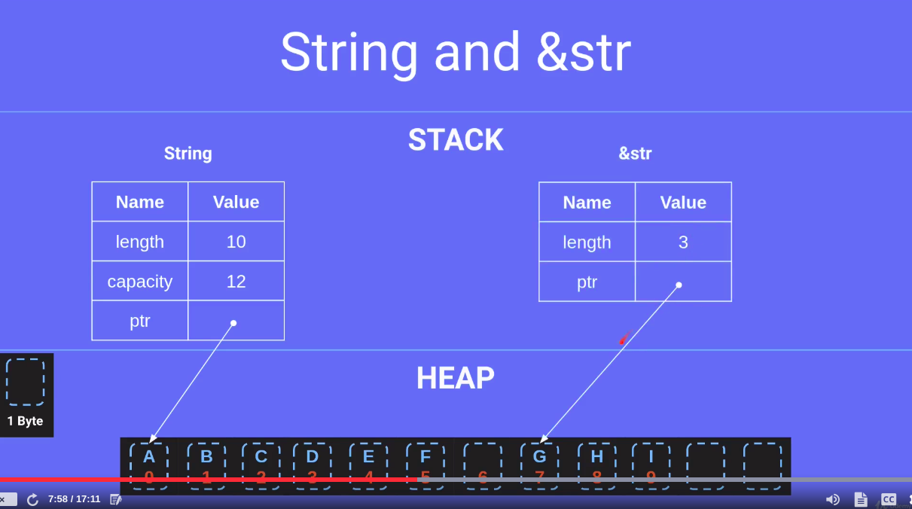
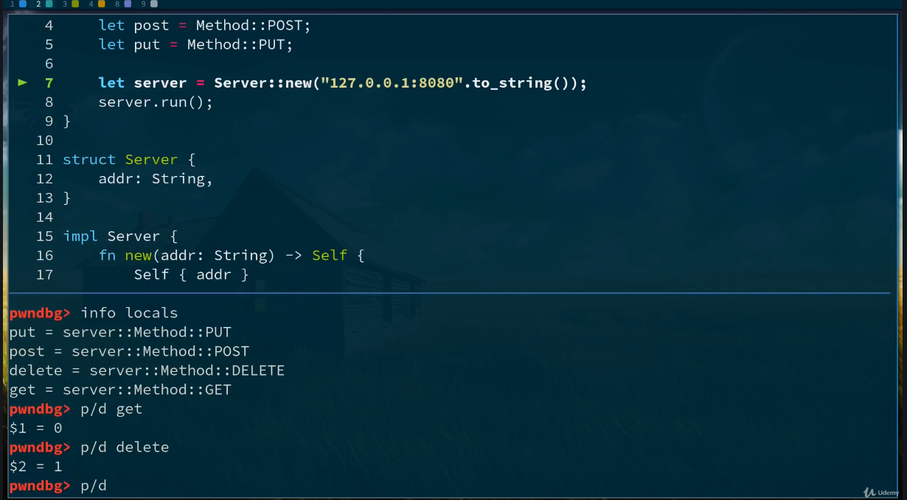

# Indice
- [Introduccion](#introduccion)
- [Instalacion](#instalacion)
- [Memoria](#memoria)
- [Tipos de datos](#tipos-de-datos)
- [Cargo expand](#cargo-expand)
- [Variables](#variables)
- [Reglas](#reglas)
- [Structs](#structs)
- [String](#string)
- [Enums](#enums)
- [Modules](#modules)
- [Errors](#errors)
- [Loops](#loops)
- [Tuples](#tuples)


# Introduccion
https://doc.rust-lang.org/book/ch02-00-guessing-game-tutorial.html#comparing-the-guess-to-the-secret-number

### Rust
- Rapido y manejo de memoria eficiente
- Muy bueno para la seguridad
- No existe null
- No existen Excepciones
- Buen manejador de paquetes (como npm)

# Instalacion
You can install rust from the oficial site: https://www.rust-lang.org/learn/get-started
```
curl --proto '=https' --tlsv1.2 -sSf https://sh.rustup.rs | sh
```

```sh
rustc --version # Compilador
cargo --version # manejador de paquetes
rustup --version # instalador, podemos actualizar rustc o cargo
```

Instalamos la extension **rust**, **better TOML** y **crates** del VS Code. <br />

Standart libraries: https://doc.rust-lang.org/std/prelude/index.html

### Create new project
We use cargo

```sh
cargo new my-project
```

### Cargo.toml 
Tenemos las dependencias, metadatas y config de compilacion, podemos ir agregando crates.io -> https://crates.io/
- entramos al sitio
- buscamos una dependencia como rand
- copiamos el package = version
- lo pegamos en el archivo TOML
- y por ultimo ejecutamos el build


### Instalacion y compilacion

```sh
cargo build # instalamos dependencias
cargo run # compilamos
cargo check # quickly check

cargo update # update the dependencies

cargo install cargo-expand # instalamos con cargo directamente

cargo expand
# Si nos tira error de toolchain
rustup toolchain list # enlistamos para ver que version tenemos, y vemos que solo esta la estabe
rustup toolchain install nightly-x86_64-unknown-linux-gnu # instalamos tambien la version nightly

```

ejecutamos lo siguiente para ejecutar en modo debug
```bash
gdb mars_calc
```

La carpeta **target** es como el node_module de node, donde van a estar nuestras dependencias


# Memoria

## Variables

- Mutable Variable: The same memory location is reused and updated.
- Constant: Stored in a read-only section of memory.
- Shadowing: Each shadowed variable gets a new memory location, and previous variables are no longer accessible within the new scope.

```
Mutable Variable (mut): When you declare a variable as mutable and update its value, the same memory location is reused. This means that no additional memory is allocated for the new value; the existing memory is simply updated.

Shadowing: When you shadow a variable, a new memory location is allocated for each new value. The previous variable is no longer accessible within the new scope, but it still occupies memory until it goes out of scope and is cleaned up by Rust's ownership system.
```

### Stack

```rust
fn main() {
    let a = 2;
    stack_only(a);
}

fn stack_only(b: i32) -> i32 {
    let c = 3;
    return c;
}
```
En este caso vamos a tener 2 stacks:
- stack main: a = 2
- stack stack_only: con c = 3 y b = 2
- una vez que salimos de la funcion el stack_only desaparece

<br />
Si llamamos infinitas funciones

```rust
fn infinite() {
    call infinite
}
```

va a llegar un punto que el sistema va a colapsar por falta de recursos, el manejo de los stacks depende de la aquitectura del equipo, si mandamos infinitas funciones va a llegar un punto que va a generar un error de **STACK OVERFLOW**


### Heap

la region de los procesos de memoria que no son automaticos, liberacion de memoria manual.<br/ > No tiene restricciones de tamaño.<br/ > 
Es posible acceder por alguna funcion en cualquier lugar del programa
```rust
fn main() {
    let a = 2;
    stack_only(a);
}

fn stack_only(b: i32) -> i32 {
    let c = 3;
    return c;
}

fn stack_and_heap() -> i32 {
    let d = 5;
    pointer e = allocate integer 7;
}
```
En este caso se guarda en e la direccion de memoria,
cuando termina la funcion se libera el stack pero el 7 sigue en el 
Heap almacenado en la direcccion de memoria


Rust no es como java, javascript o Go que el heap se limpia automaticamente, nosotros en Rust tenemos que liberar el espacio de memoria, para esto podemos utilizar SMART POINTER (como Box::new), para que se libere el espacio de memoria una vez que la funcion se libere del stack

# Tipos de datos

- boolean
- characters
- integer
- floats


| Length | Signed | Unsigned |
|--------|--------|----------|
| 8-bit  | i8     | u8       |
| 16-bit | i16    | u16      |
| 32-bit | i32    | u32      |
| 64-bit | i64    | u64      |
| 128-bit | i128  | u128     |
| arch   | isize  | usize    |


# Cargo expand
Descargamos de github, nos ayuda a ver nuestro codigo expandido, con lo que hace internamente cada funcion como **println!**

# Variables
Las variables son inmutables por defecto, esto significa que los valores que se le asignan a una variable no pueden ser modificados, para eso debemos declararlo como mutable
```rust
let mut input = String::new();
```
Definir tipo de dato
```rust
// defino que es un flotante de 32bytes
let weight: f32 = input.trim().parse().unwrap();
```

# Reglas

- Each value in Rust is owned by a variable
- When the owner goes out of scope, the value will be deallocated
- There can only be ONE owner at a time (Solo debe haber un dueño del valor para las variables)

```rust
fn main(){
    let mut input = String::new();
    some_fn(input)

    // me va a generar error porque ya utilice input arriba en some_fn
    io::stdin().read_line(&mut input);
}
// pasa a ser el owner aca y pincha cuando queramos volver a utilizar input en el main
fn some_fn(s: String){}
```

```rust
fn main(){
    let mut input = String::new();
    some_fn(&mut input)

    // me va a generar error porque ya utilice input arriba en some_fn
    io::stdin().read_line(&mut input);
}

// de esta manera le definimos que no sea el owner

// Si modificamos en la funcion se va a ver reflejado afuera
fn some_fn(s: &mut String){}

// Si modificamos en la funcion NO se va a ver reflejado afuera
fn some_fn(s: &String){}
```

# Structs

```rust

struct MyStruct {
    addr: String,

}

// bloque de implementacion
impl MyStruct{

    // generamos metodo new
    // devuelve la instancia del struct
    fn new(adde: String) -> Self{
        Self {
            //addr: addr
            addr
        }
    }

    // metodo del struct
    // self representa la instancia del struct
    // &self no lo toma como dueño (ownership) &mut self y lo toma como mutable
    fn run(self){
        println!("Listening in {}", self.addr);
    }
}
```

# String
```rust
let string = String::from("test");

// string_slice hace borrow de string
let string_slice = &string[10..14]; // desde el 10 hasta el 14 (str)
// no significa que va hasta el caracter 10, significa que va hasta el byte 10
// puede haber caracteres (letras japonesas, etc..) que tenga mas de un caracter
// si corto el caracter a la mitad pincha el programa

let string_borrow: &str = &string;
let string_literal = "1234" // nuevo espacio de memoria, es inmutable

dbg!(string); // por eso pincharia aca (lo tiene string_slice)
// para eso deberiamos utilizar
// dbg!(&string);
dbg!(string_slice);
dbg!(string_borrow);
dbg!(string_literal);

```


# Enums
En memoria, los enums representan un siemple numero, empezando por 0 hasta n+1
```rust
enum Method {
    GET,
    PUT,
    //POST,
    POST = 5, // le puedo definir un valor, desde el get empezaria con 0 
              // y a partir de aca iria de 5 (6,7,8,...)
    DELETE,
    OPTIONS,
    HEAD,
}

// para traer el valor
let get = Method::GET;

```

<br />

```rust
enum Method {
    GET(String),
    PUT(u64),
    POST,
    DELETE,
    OPTIONS,
    HEAD,
}

let get = Method::GET("asds".to_string());
let delete = Method::DELETE(100);
```

### OPTION ENUM
Representa **None** si no hay valores y **Some** si tiene algun valor
```rust
//option.rs
pub enum Option<T> {
    None,
    Some(T),
}
```
```rust
struct Request {
    query_string: Option<String>
}
```

# Modules
Por defecto los metodos y funciones son privadas, si necesito que sean publicas debo indicarselo
```rust
fn main(){
    let server = mystruct::MyStruct::new("sarasa");
}

// genero otro namespace con los modulos, en este caso mystruct
mod mystruct{

    // por defecto son privadas, debo indicarlas como publicas
    pub struct MyStruct {
        addr: String,

    }

    impl MyStruct{

        pub fn new(adde: String) -> Self{
            Self {
                addr
            }
        }

        pub fn run(self){
            println!("Listening in {}", self.addr);
        }
    }
}
```
Podemos utilizar **use** para no tener que llamar a todo el modulo siempre
```rust
use mystruct::MyStruct

fn main(){
    let server = MyStruct::new("sarasa");
}
```
### Sub Moduls
```rust
mod http {
    pub mod request {
        struct Request {
            path: String,
            query_string: Option<String>,
            // con super hacemos referencia al modulo padre
            method: super::method::Method,
        }
    }

    pub mod method {
        pub enum Method {
            GET,
            PUT,
            POST,
            DELETE,
            OPTIONS,
            HEAD,
        }
    }
}

```

### Modules files
El modulo sera el mismo nombre que el archivo
```rust
//server.rs

pub struct Server {
    addr: String,

}

impl Server{

    pub fn new(adde: String) -> Self{
        Self {
            addr
        }
    }

    pub fn run(self){
        println!("Listening in {}", self.addr);
    }
}

```

```rust
// main.rs

use server::Server;

// el mismo nombre del archivo, para hacer referencia a el
mod server;

fn main(){
    let server = Server::new("sarasa");
}
```


### Sub Modules files
Creamos el folder http y dentro los archivos request.rs y method.rs<br />
para eso debemos crear un archivo **mod.rs**
```rust
//http/method.rs

pub enum Method {
    GET,
    PUT,
    POST,
    DELETE,
    OPTIONS,
    HEAD,
}
```

```rust
//http/mod.rs
pub use request:Request;
pub use method:Method;

pub mod request;
pub mod method;
```

```rust
// main.rs

use http::Request;
use http::Method;

// el mismo nombre del folder, para hacer referencia a el
mod http;

fn main(){
    // TODO
}
```

# Errors
Se dividen en 2 categorias:
- recoverable: ej-> file not found
- unrecoverable: ej-> intentar ingresar a un index mas alla de donde termina el array
<br />

**RUST NO SOPORTA EXCEPCIONES**<br />
Podemos utilizar el enum **Result**
```rust
pub enum Result<T, E> {
    Ok(T), //Success value
    Err(E) //Error value
}
```

# Loops

```rust
// Loop infinito
loop {
    // TODO
}

// Podemos utilizar los breaks para salir
loop {
    break;
}

// Podemos hacer referecia al loop padre para salir de el desde el hijo
'outer: loop {
    loop {
        break 'outer;
    }
}

// Al igual que hacer un continue
'outer: loop {
    loop {
        continue 'outer;
    }
}
```

# Tuples
Puedo tener varios tipos de datos
```rust
let tup = (5, "String", listener);
```

```rust

fn run() -> (i32, &str, std::net::TcpListener) {
    (5, "a", listener)
}
```

# Match
Nos sirve para controlar las Tuples

```rust
// listenet.accept() nos devuelve una tupla de 2 valores,
// nos ayuda a manejar los enums
// en este caso solo tenemos Ok y Err
match listenet.accept() {
    // Ok tiene dos valores en este caso de la tupla (TcpStream y SocketAddr)
    Ok( (stream, _) ) => {
        // para ignorar utilizamos _ como en Golang
    },
    Err(e) => {
        println!("{}", e)
    },
    _ => {
        // ninguna de las variantes anteriores
    }
}


match "abdc" {
    "abdc" => {},
    "a" | "b" => {}, //or
    _ => {},
}
```

# Arrays
En Rust siempre debemos definir el tamaño del array y el contenido que va a tener al inicializar (y evitar que tenga basura como en C)<br /><br />
https://stackoverflow.com/questions/34684261/how-to-set-a-rust-array-length-dynamically
```rust
let a = [1,2,3,4]; //[i32, 4] [tipo de dato, size]

fn arr(a: [u8; 5]){} //debemos definirle el tipo y el tamaño

//Si queremos pasar el array y no sabemos el tamaño tenemos que pasarle la referencia
fn arr(a: &[u8]) {}

let mut buffer = [0;1024] // debemos definir al inicializar el tamaño del array, en este caso 1024 (1024 bytes, y le asignamos todos los valores en 0
```