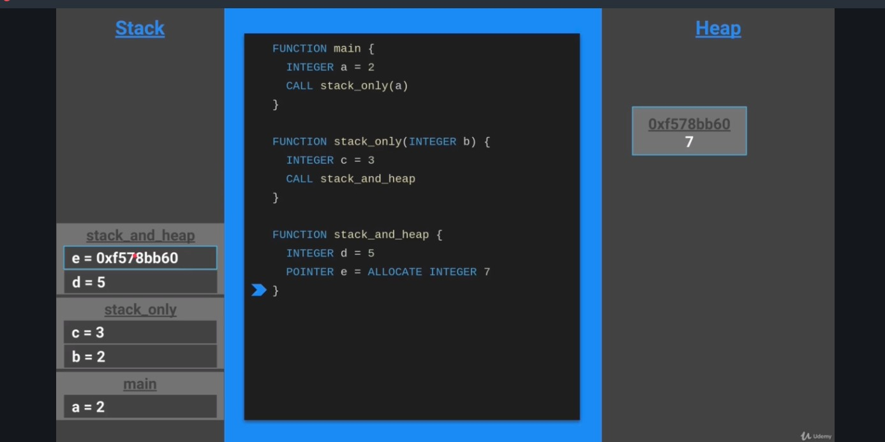

# Indice
- [Introduccion](#introduccion)
- [V8 y JavaScript Engines](#v8-y-javascript-engines)
- [NodeJS](#nodejs)
- [ES6](#es6)
- [Autentificacion](#autentificacion)
- [Unit Test](#unit-test)
- [Sincronia vs Asicnronia](#sincronia-vs-asicnronia)
- [Base de datos](#base-de-datos)
- [Arquitectura Apis](#arquitectura-apis)
- [Microservicios](#microservicios)


# Introduccion

### Rust
- Rapido y manejo de memoria eficiente
- Muy bueno para la seguridad
- No existe null
- No existen Excepciones
- Buen manejador de paquetes (como npm)

# Instalacion
Debemos entrar al sitio oficial de rust  y realizar las inastalaciones

```sh
rustc --version # Compilador
cargo --version # manejador de paquetes
rustup --version # instalador, podemos actualizar rustc o cargo
```

Instalamos la extension **rust**, **better TOML** y **crates** del VS Code

### Creamos proyecto
Utilizaremos cargo

```sh
cargo new my-project
```

### Cargo.toml 
Tenemos las dependencias, metadatas y config de compilacion, podemos ir agregando crates.io -> https://crates.io/
- entramos al sitio
- buscamos una dependencia como rand
- copiamos el package = version
- lo pegamos en el archivo TOML
- y por ultimo ejecutamos el build


### Instalacion y compilacion

```sh
cargo build # instalamos dependencias
cargo run # compilamos

cargo install cargo-expand # instalamos con cargo directamente

cargo expand
# Si nos tira error de toolchain
rustup toolchain list # enlistamos para ver que version tenemos, y vemos que solo esta la estabe
rustup toolchain install nightly-x86_64-unknown-linux-gnu # instalamos tambien la version nightly

```


La carpeta **target** es como el node_module de node, donde van a estar nuestras dependencias


# Memoria

### Stack

```rust
fn main() {
    let a = 2;
    stack_only(a);
}

fn stack_only(b: i32) -> i32 {
    let c = 3;
    return c;
}
```
En este caso vamos a tener 2 stacks:
- stack main: a = 2
- stack stack_only: con c = 3 y b = 2
- una vez que salimos de la funcion el stack_only desaparece

<br />
Si llamamos infinitas funciones

```rust
fn infinite() {
    call infinite
}
```

va a llegar un punto que el sistema va a colapsar por falta de recursos, el manejo de los stacks depende de la aquitectura del equipo, si mandamos infinitas funciones va a llegar un punto que va a generar un error de **STACK OVERFLOW**


### Heap

la region de los procesos de memoria que no son automaticos, liberacion de memoria manual.<br/ > No tiene restricciones de tamaño.<br/ > 
Es posible acceder por alguna funcion en cualquier lugar del programa
```rust
fn main() {
    let a = 2;
    stack_only(a);
}

fn stack_only(b: i32) -> i32 {
    let c = 3;
    return c;
}

fn stack_and_heap() -> i32 {
    let d = 5;
    pointer e = allocate integer 7;
}
```
En este caso se guarda en e la direccion de memoria,
cuando termina la funcion se libera el stack pero el 7 sigue en el 
Heap almacenado en la direcccion de memoria



Rust no es como java, javascript o Go que el heap se limpia automaticamente, nosotros en Rust tenemos que liberar el espacio de memoria, para esto podemos utilizar SMART POINTER (como Box::new), para que se libere el espacio de memoria una vez que la funcion se libere del stack